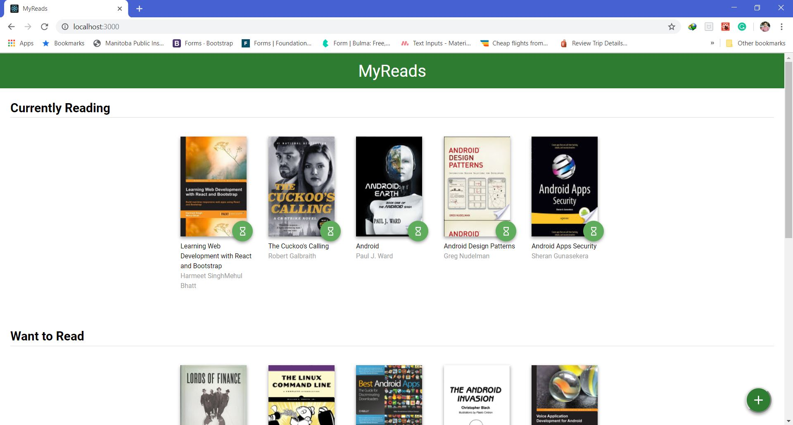
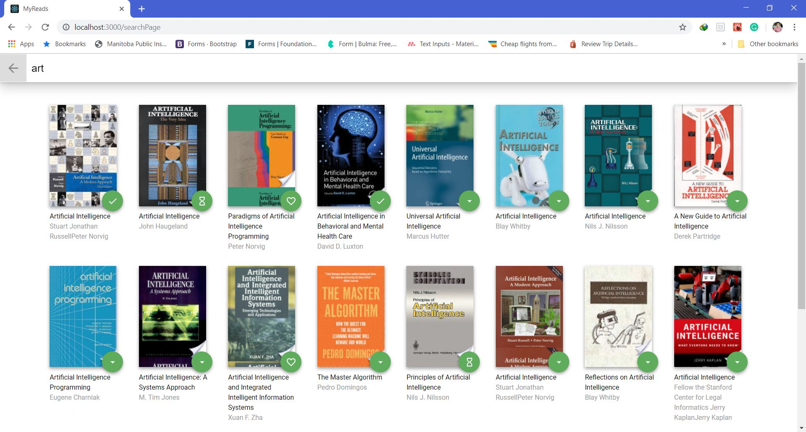

# Bok-App
---
## Technologies 
 1. HTML
 2. CSS
 3. React JS
 4. Book Api
 
## Specification
  1. User Will have two pages main page where they can see selected book from search page.
  2. User can interact in search page and mark books as read, wanted to read and already read.
  3. Search page shows error message in case of no result found for search term.
  4. icon changes its svg as user move from one selected option to other for each book.
  
## Implementation
 This project was a part of the udacity projects in which they provides backend js api to collect bookdata and ui structures. My task was to make this react app working perfectly. First of all I satared working on route and separate two pages search page and home page.Thenm I separate all the component and solved all issues.
 
## Screen-Shots
1. Home page
 
2. Search page
 
